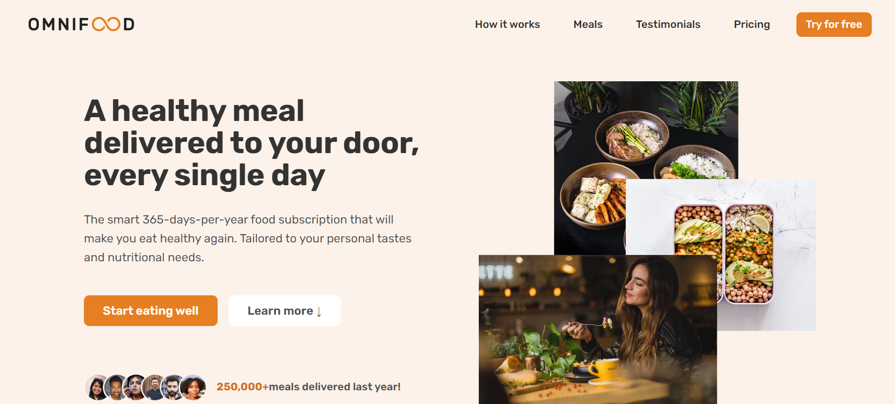
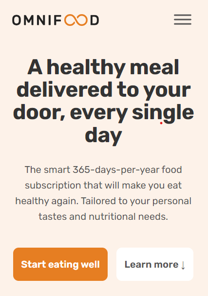

# Omnifood

_**What is Omnifood project?** Omnifood is single page website which is a fictional company focused on providing AI-based meals through a subscription service.You can [visit](https://omnifood-gulsah-duzgun.netlify.app/) by clicking link_
 
 

## What did I learn during developing this project?

 

_When I created the website from scratch, I learned how to create and implement features that I'm likely to use in my future websites over over again._

> #
>
> - work with media queries
> - smooth scrolling on all browsers (I wrote javascript code to run in safari)
> - with IntersectionObserver() I added a sticky navbar when the hero section is out of scope
> - I compressed images using squoosh
> - check the website using Chrome Lighthouse
> - I learned Web design rules (Typography, color, images and illustrations, icons etc.)
> - responsive web design
> - added functional form using Netlify features
>
> #

 
 

 
 

